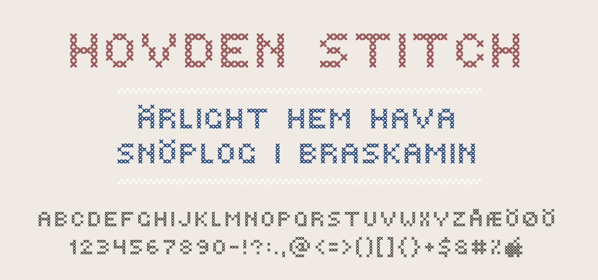

# Hovden Stitch

Hovden Stitch is a typeface I made while injured from a snowboarding accident,
tucked in a cabin in remote Hovden, Telemark, Norway in 2002.

The original source has been converted to UFO in this repo,
and the `font-files` directory contains OTF and TTF files.

### [⬇︎ Download the OTF file](https://raw.githubusercontent.com/rsms/hovden-stitch/master/font-files/HovdenStitch-Regular.otf)
